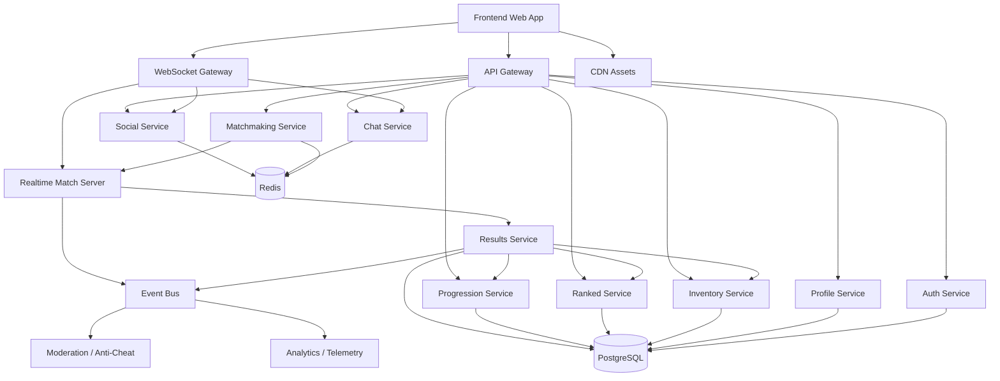

# Pixel Panic Software Architecture

## Purpose
This document defines the production software architecture for Pixel Panic, a competitive online multiplayer 2D browser game. It translates the approved Game Design Document into an implementable project structure, service layout, networking model, data model, and deployment strategy.

This is an architecture-first document. It intentionally does not implement gameplay. The goal is to establish a scalable, modular, and secure foundation so the game can be built in phases without reworking core systems later.

---

## 1. Architectural Goals
Pixel Panic needs an architecture that supports fast real-time multiplayer, low friction browser access, social features, live progression, and cosmetics-only monetization. The main architectural goals are:

- Keep the real-time match simulation authoritative on the server.
- Keep frontend UI and game rendering separate from backend game state.
- Make services modular so teams can work in parallel.
- Support desktop and mobile browsers with the same codebase.
- Minimize cheating by reducing client trust.
- Make live operations features like events, ranked seasons, and shop rotations data-driven.
- Keep the system small enough for an indie team to ship and maintain.

The architecture should optimize for correctness, scalability, and operational clarity rather than premature microservice sprawl.

---

## 2. High-Level System Overview
The product should be split into four major layers:

1. **Frontend client**
   - Web app shell.
   - Game renderer.
   - UI overlays.
   - Social panels.
   - Input handling.
   - Realtime network client.

2. **Backend platform services**
   - Authentication.
   - Profiles.
   - Friends and parties.
   - Inventory and cosmetics.
   - Progression and missions.
   - Leaderboards and ranked state.
   - Chat and moderation.

3. **Realtime game layer**
   - Matchmaking.
   - Room allocation.
   - Match server simulation.
   - State synchronization.
   - Match results ingestion.

4. **Infrastructure and data layer**
   - Relational database.
   - Cache / presence store.
   - Message broker or event bus.
   - Object storage for assets and logs.
   - CDN.
   - Observability stack.

---

## 3. Recommended Technology Stack
These recommendations balance browser performance, developer productivity, and multiplayer reliability.

### Frontend
- **TypeScript** for all client code.
- **React** for application shell, menus, social UI, progression screens, store, and settings.
- **PixiJS** or **Phaser 3** for the game rendering layer.
- **Zustand** or lightweight state management for client UI state.
- **Vite** for fast local development and builds.
- **WebSocket** for realtime match communication.
- **WebRTC** only if voice chat is peer-assisted; otherwise managed voice SDK integration.

### Backend Services
- **TypeScript / Node.js** for account, social, progression, chat, and admin services.
- **PostgreSQL** as the system of record.
- **Redis** for presence, session coordination, rate limits, and short-lived matchmaking data.
- **NATS** or **Kafka** for event-driven cross-service updates.
- **gRPC or internal HTTP APIs** for service-to-service communication.

### Realtime Game Servers
Two good implementation paths exist:
- **Go** for highly efficient authoritative match servers.
- **TypeScript with a specialized game server framework** if the team strongly values code reuse over low-level performance.

For a production-ready competitive game, Go is the safer default for match servers because it is efficient, predictable, and straightforward to operate.

### Infrastructure
- **Docker** for packaging.
- **Kubernetes** or managed container orchestration for scale.
- **CDN** for static assets and media.
- **Cloud load balancers** for region routing.
- **Object storage** for replays, logs, and content assets.
- **Monitoring stack** with metrics, logs, and tracing.

### Voice Chat
- Prefer a third-party managed voice provider or a self-hosted WebRTC SFU if the team has the operational maturity.
- Voice should be isolated from core gameplay services.

---

## 4. Frontend Architecture
The frontend should be a hybrid application: a browser UI shell wrapped around a realtime 2D game runtime.

### 4.1 Frontend Layers
#### App Shell Layer
This layer handles:
- Login.
- Main menu.
- Party and friends.
- Cosmetics and inventory.
- Ranked, missions, and achievements.
- Store and progression.
- Settings.
- Chat and social panels.

#### Game Runtime Layer
This layer handles:
- Player input.
- Rendered game scenes.
- Camera.
- HUD.
- Match state visualization.
- Prediction and reconciliation.
- Local effects and animations.

#### Network Adapter Layer
This layer handles:
- WebSocket lifecycle.
- Message serialization and deserialization.
- Client-side prediction.
- State patch application.
- Match reconnect logic.
- Heartbeats and latency tracking.

#### Shared Domain Layer
This layer contains:
- Shared DTOs and schemas.
- Match protocol types.
- Validation rules.
- Common constants.
- Rank and reward definitions.

### 4.2 Frontend Responsibilities
The frontend should never own authoritative game state. It may predict motion and animation for responsiveness, but every gameplay-relevant outcome must be confirmed by the server.

The frontend is responsible for:
- Input capture and normalization.
- Rendering and animation.
- Local feedback and responsiveness.
- UI state and navigation.
- Match presentation.
- Local caching of non-sensitive profile data.

### 4.3 Frontend Design Principles
- UI state must be separate from match simulation state.
- Gameplay rendering must not be tightly coupled to React component rerenders.
- Network handling must survive reconnects and page visibility changes.
- Mobile and desktop controls should share the same input abstraction.
- The client should degrade gracefully under packet loss or reconnect events.

---

## 5. Backend Architecture
The backend should be organized as a small number of domain services instead of many tiny services at launch.

### 5.1 Core Services
#### Identity and Auth Service
Responsible for:
- Login and session issuance.
- Account creation.
- Token refresh.
- External provider linking.
- Abuse prevention at login.

#### Profile Service
Responsible for:
- Player profile data.
- Display name.
- Avatar/banner customization.
- Level and XP.
- Titles and badges.
- Settings persistence.

#### Inventory and Cosmetics Service
Responsible for:
- Ownership of cosmetic items.
- Unlocks and grants.
- Shop catalog state.
- Seasonal rewards.
- Cosmetic loadouts.

#### Social Service
Responsible for:
- Friends.
- Parties.
- Presence.
- Invites.
- Block lists.
- Recent player history.

#### Progression Service
Responsible for:
- XP rewards.
- Leveling.
- Missions.
- Weekly challenges.
- Seasonal event participation.

#### Ranked and Leaderboard Service
Responsible for:
- Match rating updates.
- League promotion and demotion.
- Seasonal ranked resets.
- Leaderboard snapshots.
- Anti-smurf heuristics and integrity signals.

#### Chat Service
Responsible for:
- Text chat channels.
- Moderation.
- Rate limiting.
- Message persistence rules.
- Reporting and abuse controls.

#### Matchmaking Service
Responsible for:
- Queue intake.
- Skill and region matching.
- Party composition rules.
- Mode selection.
- Room reservation.
- Hand-off to realtime servers.

#### Match Results Service
Responsible for:
- Final match ingestion.
- Reward calculation.
- Stat persistence.
- Leaderboard and mission updates.
- Replay or event log persistence if enabled.

### 5.2 Backend Design Principle
Services should communicate through well-defined contracts and domain events. The game should not depend on direct cross-service database access.

### 5.3 Service Granularity Guidance
At launch, combine related account-facing features into one or two deployable backend services if that simplifies operations. Split them later only when scale or team size demands it.

Recommended launch grouping:
- Account service
- Social service
- Economy service
- Competitive service
- Realtime match service
- Chat service
- Admin and moderation service

---

## 6. Networking Architecture
Pixel Panic is a realtime multiplayer game, so networking architecture is central to the product.

### 6.1 Networking Model
The network model should use:
- **Server-authoritative simulation** for all gameplay outcomes.
- **Client-side prediction** for player movement and some local animations.
- **State reconciliation** to correct drift.
- **Delta updates** rather than full state updates.
- **Interest management** so clients receive only relevant state.

### 6.2 Transport
- **WebSocket** is the primary transport for realtime gameplay in browsers.
- Optional **HTTP/REST** for non-realtime actions.
- Optional **gRPC** internally between services.

### 6.3 Realtime Message Types
The protocol should separate messages into these categories:
- Authentication and session setup.
- Match join and room state.
- Input commands.
- Server snapshots.
- State deltas.
- Events and effects.
- Heartbeats and connection health.
- Disconnect, reconnect, and resume flows.

### 6.4 Synchronization Rules
- Clients send compact input packets, not authoritative positions.
- The server simulates movement, hazards, combat, powerups, and scoring.
- The server periodically emits authoritative snapshots.
- The client predicts locally and reconciles on receipt.
- Projected animations may continue even if the authoritative state changes, but gameplay must snap to truth cleanly.

### 6.5 Latency Strategy
- Regional matchmaking should place players near the match server whenever possible.
- Movement should be tolerant of moderate jitter.
- Match rules should minimize the need for frame-perfect reactions at the network layer.
- Reconnect windows should be generous enough for mobile network interruptions.

---

## 7. Game Server Architecture
The game server is the most sensitive piece of the system and should be built as a dedicated authoritative runtime.

### 7.1 Match Server Responsibilities
Each match server owns:
- Player state.
- Arena state.
- Hazards.
- Powerups.
- Obstacles.
- Scoring.
- Match timer.
- Win conditions.
- Disconnect and reconnect handling.
- Final match result generation.

### 7.2 Match Server Lifecycle
1. Matchmaking reserves a room.
2. The match server instance is allocated or selected.
3. Players connect and authenticate.
4. Match starts after readiness or countdown.
5. The server simulates the game until completion.
6. The server posts authoritative results to backend services.
7. The room is torn down or returned to the pool.

### 7.3 Simulation Model
The game simulation should be deterministic or close to deterministic where practical. Even if the runtime itself is not perfectly deterministic across all clients, the server should remain the single source of truth.

### 7.4 Instance Strategy
Two deployment strategies are viable:
- **One match per isolated room instance** for maximum integrity and easier operations.
- **Multiple rooms per process** for efficiency if the runtime is robust enough.

For competitive integrity and simpler debugging, the best default is room-isolated instances or clearly sandboxed match sessions within a process with strict state separation.

### 7.5 Match Server Scaling
Scale by:
- Region.
- Queue demand.
- Current active sessions.
- CPU headroom.
- Memory headroom.
- Average match duration.

### 7.6 Server Authority Boundaries
The server must validate:
- Movement requests.
- Action cooldowns.
- Powerup pickups.
- Collision and hazard resolution.
- Scoring events.
- Inventory-sensitive outcomes such as ranked awards or mission completions.

---

## 8. Room and Match Flow
How game rooms work should be defined before implementation because room design affects matchmaking, reconnects, spectators, and social play.

### 8.1 Room Types
- **Public match room**: created by matchmaking.
- **Private room**: created by a host, joinable by invite or code.
- **Practice room**: low-stakes or solo testing environment.
- **Spectator room**: read-only access to a live match.

### 8.2 Room State
Each room should have:
- Room ID.
- Region.
- Mode.
- Map seed or selected map.
- Player roster.
- Team assignments.
- Match phase.
- Connection state.
- Spectator permissions.

### 8.3 Room Authority
The room state is owned by the match server, not the frontend and not the general backend services.

### 8.4 Room Join Flow
- Player authenticates with platform token.
- Matchmaking or invite service returns room metadata.
- Client connects to the correct region and room endpoint.
- Match server validates token, region, and join eligibility.
- Client receives room snapshot and begins sync.

### 8.5 Private Room Rules
Private rooms should support custom settings but remain constrained by fairness and performance. They can use the same simulation layer as public matches while bypassing the rating pipeline.

---

## 9. Player Synchronization
Player synchronization should be authoritative, forgiving, and efficient.

### 9.1 What the Client Predicts
The client may predict:
- Movement start and stop.
- Local facing direction.
- Animation transitions.
- Cosmetic effects.
- Input buffering.

### 9.2 What the Client Must Not Predict Authoritatively
The client must not decide:
- Final hits.
- Final trap outcomes.
- Powerup ownership.
- Damage or elimination results.
- Ranked scoring.
- Mission credit.

### 9.3 Sync Approach
A typical flow should be:
1. Client sends compact input intent.
2. Server validates and simulates.
3. Server sends a periodic snapshot and event deltas.
4. Client compares predicted state to server truth.
5. Client reconciles minor drift and replays buffered inputs if needed.

### 9.4 Ghosting and Lag Compensation
If necessary, the server may use small time windows for collision or action resolution to make latency feel fair. These should be narrow and consistent to avoid abuse.

### 9.5 Reconnect Behavior
If a player disconnects briefly:
- Preserve room membership when possible.
- Resume the player in the same match if reconnect occurs within a defined grace period.
- Prevent abuse by limiting repeated resync loops.

---

## 10. Database Architecture
The database layer should be split by data class, not by feature hype.

### 10.1 System of Record
Use **PostgreSQL** as the canonical datastore for:
- Accounts.
- Profiles.
- Inventory.
- Cosmetics ownership.
- Progression.
- Ranked history.
- Leaderboards snapshots.
- Missions and achievements.
- Social graph.
- Moderation records.

### 10.2 Fast Access Stores
Use **Redis** or equivalent for:
- Presence.
- Queue state.
- Temporary room metadata.
- Rate limits.
- Short-lived invites.
- Session caches.
- Locking or reservation coordination.

### 10.3 Event and Analytics Storage
Use one of the following for telemetry and gameplay analytics:
- A warehouse-oriented event pipeline.
- Append-only log storage.
- OLAP store for aggregated data.

### 10.4 Data Ownership
Each service should own its write path. Other services should consume its public API or its emitted events rather than directly modifying its tables.

### 10.5 Important Data Entities
- Player
- Account
- Session
- Party
- Friend relation
- Match record
- Match participant
- Rank record
- Season progress
- Mission progress
- Inventory item
- Cosmetic unlock
- Chat message
- Report case
- Ban / mute action

### 10.6 Schema Strategy
- Keep core tables normalized.
- Store mode or event-specific properties in extensible JSON only when necessary.
- Keep leaderboard and season computations derived from authoritative match records.

---

## 11. Authentication System
Authentication must be simple for players and secure for the platform.

### 11.1 Recommended Auth Model
Support:
- Email-based account creation.
- Social login where appropriate.
- Guest-to-account upgrade if business rules allow.
- Persistent sessions with refresh rotation.

### 11.2 Auth Tokens
Use:
- Short-lived access tokens.
- Long-lived refresh tokens stored securely.
- Session invalidation on suspicious activity or manual logout.

### 11.3 Security Requirements
- Passwords stored with strong hashing and salting.
- Tokens signed and audience-restricted.
- Rate limiting on login and recovery endpoints.
- Device or browser fingerprint signals only as a supplemental defense, not a single trust anchor.
- Support account recovery flows.

### 11.4 Login UX Requirements
- Fast guest or first-time access if allowed.
- Low-friction account linking.
- Clear state when a session expires.
- Seamless handoff between menu, social, and gameplay.

---

## 12. Leaderboards and Ranked Data
Leaderboards and ranked data should be handled as a dedicated competitive subsystem.

### 12.1 Leaderboard Types
- Global ranked ladder.
- Regional ranked ladder.
- Friends leaderboard.
- Seasonal event leaderboard.
- Character mastery leaderboard.
- Win streak or performance board.

### 12.2 Ranked Updates
Rank updates should be:
- Computed after authoritative match results.
- Stored as a historical trail, not only a current number.
- Protected from duplicate submissions.

### 12.3 Snapshot Strategy
Use periodic leaderboard snapshots for display and cached ranking views. This reduces expensive live reads and prevents UI thrash.

### 12.4 Integrity Requirements
- Prevent replayed or forged match results.
- Use server-signed result records.
- Flag anomalous rating gain patterns.

---

## 13. Statistics and Telemetry
Statistics are required for balance, live operations, and anti-cheat.

### 13.1 Match Statistics
Track:
- Time alive.
- Eliminations.
- Assists.
- Objective score.
- Hazard damage.
- Powerup pickups.
- Map participation.
- Win rate.
- Disconnects.

### 13.2 Operational Statistics
Track:
- Queue times.
- Match completion rate.
- Crash rate.
- Reconnect rate.
- Region performance.
- Latency distributions.
- Chat abuse rates.

### 13.3 Design Analytics
Track:
- Tutorial completion.
- First-session retention.
- Mission completion.
- Cosmetic conversion.
- Ranked participation.
- Party play frequency.

### 13.4 Data Flow
Game servers emit match events, which are ingested into a results pipeline. Aggregated metrics then feed dashboards, balancing tools, and economy tuning.

---

## 14. Friends, Parties, and Presence
Social systems should be centralized so the frontend can render them consistently.

### 14.1 Friends Service Responsibilities
- Friend requests.
- Accept / reject flow.
- Block lists.
- Recent players.
- Relationship status.

### 14.2 Presence Model
Presence should show:
- Online.
- In lobby.
- In queue.
- In match.
- In private room.
- Away / idle.

### 14.3 Party Model
Parties should be lightweight data objects with:
- Host or leader.
- Member list.
- Readiness.
- Queue eligibility.
- Voice or chat channel linkage.

### 14.4 Real-Time Updates
Presence should update via event pushes rather than polling wherever possible.

---

## 15. Inventory and Cosmetics
The cosmetic economy should be implemented as a clean ownership and entitlement system.

### 15.1 Inventory Service Responsibilities
- Grant items.
- Remove temporary access when required.
- Track permanent ownership.
- Resolve seasonal rewards.
- Support bundle delivery.

### 15.2 Cosmetic Categories
- Skins.
- Palettes.
- Emotes.
- Victory poses.
- Trails.
- Sprays/stickers.
- Banners.
- Nameplate effects.
- Match intro and outro cosmetics.

### 15.3 Loadout State
The loadout is player-selected presentation data stored separately from ownership. This distinction prevents accidental inventory overwrites and makes cosmetic preview fast.

---

## 16. Profile System
The profile system is the player-facing identity layer.

### 16.1 Profile Data
- Display name.
- Avatar.
- Banner.
- Titles.
- Level.
- Ranked badge.
- Favorite character.
- Selected cosmetic loadout.
- Privacy settings.

### 16.2 Profile Views
The client should support:
- Self profile.
- Friend profile.
- Public profile preview.
- Recent player profile.
- Ranked profile card.

### 16.3 Privacy Rules
Players should control which profile fields are public, friend-visible, or hidden.

---

## 17. Settings System
Settings should be stored server-side when they affect account preference and locally when they are purely client performance tuning.

### 17.1 Server-Saved Settings
- Language.
- Region preference.
- Chat preferences.
- Privacy settings.
- Accessibility preferences.
- HUD layout preferences if supported.

### 17.2 Local Settings
- Graphics quality.
- Audio device selection.
- Input calibration.
- Control sensitivity.
- Performance overrides.

### 17.3 Sync Strategy
Settings should be merged carefully so a local device preference does not overwrite a global accessibility setting unless the user explicitly saves it.

---

## 18. Chat System
Chat should be useful, safe, and modular.

### 18.1 Chat Types
- Party chat.
- Private friend chat.
- Lobby or room chat.
- Match chat.
- System messages.

### 18.2 Chat Architecture
- Chat messages should flow through a dedicated service.
- The service should enforce rate limits and moderation filters.
- Persist only what the product and moderation policy require.

### 18.3 Moderation Controls
- Filtered words.
- Spam detection.
- Mute.
- Block.
- Report.
- Shadow or escalation handling where appropriate.

### 18.4 Mobile Considerations
Quick chat presets should exist for players who cannot type easily during play.

---

## 19. Voice Chat Integration
Voice chat is optional and should be treated as a separate platform capability rather than a core gameplay dependency.

### 19.1 Recommended Integration Strategy
The safest production approach is to integrate a managed voice provider or a dedicated voice layer using WebRTC with an SFU.

### 19.2 Voice Scope
- Party voice.
- Private room voice.
- Optional creator or tournament voice.

### 19.3 Voice Controls
- Push-to-talk.
- Open mic where appropriate.
- Mute individual users.
- Mute all.
- Report abuse.

### 19.4 Architectural Caution
Voice increases moderation and infrastructure burden significantly. It should not block the launch of the game if not ready. The architecture should allow it to be added without changing the core match protocol.

---

## 20. Communication Between Frontend and Backend
This boundary should be explicit and well versioned.

### 20.1 API Types
- **REST/HTTP** for menus, profile, inventory, progression, store, and admin operations.
- **WebSocket** for realtime match communication and low-latency social presence.
- **Internal service APIs** for backend-to-backend communication.

### 20.2 Client to Backend Examples
The frontend should request:
- Login.
- Profile state.
- Friend list.
- Inventory and cosmetics.
- Mission progress.
- Queue entry.
- Private room creation.
- Chat history where allowed.

### 20.3 Backend to Client Examples
The backend should push:
- Match snapshots.
- Queue status.
- Presence updates.
- Friend online notifications.
- Reward grants.
- Chat messages.
- Match results.
- Ranked changes.

### 20.4 Versioning
All realtime and API contracts should be versioned so the client can fail gracefully if a newer server build is deployed.

---

## 21. How Game Rooms Work
Rooms are the smallest authoritative gameplay container.

### 21.1 Room Responsibilities
A room owns one active gameplay instance. It contains the map, players, match timer, state machine, and results.

### 21.2 Room States
- Created.
- Filling.
- Ready.
- Countdown.
- Active.
- Overtime or endgame.
- Completed.
- Archived.

### 21.3 Room Communication Model
- The room accepts authenticated joins.
- Clients submit input to the room.
- The room sends snapshots and event deltas.
- The room publishes final results to backend services.

### 21.4 Room Termination
When a room ends, all final state should be persisted before teardown. Any delayed reward processing should be idempotent.

---

## 22. How Cheating Can Be Minimized
A browser game cannot eliminate cheating entirely, but it can make abuse expensive and detectable.

### 22.1 Primary Defense
- Server-authoritative simulation.
- Input-only client model.
- Strict action validation.
- Signed session tokens.
- Secure room joins.

### 22.2 Secondary Defense
- Replay or event log review.
- Behavioral anomaly detection.
- Rate limits on action spam.
- Smurf detection.
- Disconnect abuse detection.
- Suspicious pattern review for ranked integrity.

### 22.3 Design-Level Anti-Cheat
The game rules themselves should minimize exploit value:
- Avoid precision exploits that require client trust.
- Avoid hidden information the client should not see.
- Keep collision and outcome logic on the server.

### 22.4 Operational Anti-Cheat
- Ban waves rather than instant telegraphing when appropriate.
- Separate soft flags from hard enforcement.
- Build internal moderation dashboards.

---

## 23. Deployment Architecture
Deployment should support fast iteration and region-aware realtime scaling.

### 23.1 Environments
- Local development.
- Internal QA.
- Staging.
- Production.
- Event or tournament environment if needed.

### 23.2 Deployable Units
- Frontend web app.
- Backend services.
- Match servers.
- Admin tools.
- Voice infrastructure if self-hosted.

### 23.3 Release Flow
- Build and test in CI.
- Publish frontend assets to CDN.
- Deploy backend services.
- Roll out match server image.
- Verify health and telemetry.

### 23.4 Rollout Strategy
Use canary or phased deployment for backend services and match server updates. Competitive games should avoid broad unverified rollouts when possible.

---

## 24. Cloud Architecture
A cloud-native but not overcomplicated deployment is recommended.

### 24.1 Cloud Building Blocks
- Global CDN for assets.
- Load balancers for API and WebSocket ingress.
- Container orchestration for services and match servers.
- Managed PostgreSQL.
- Managed Redis.
- Object storage.
- Monitoring and alerting services.
- Managed secrets store.

### 24.2 Region Strategy
- Deploy in multiple player regions.
- Route players to the best region automatically.
- Keep matchmaking and room allocation region-aware.
- Use failover policies for non-realtime services.

### 24.3 Scaling Strategy
- Scale web services horizontally.
- Scale match servers based on queue demand.
- Scale Redis and database layers cautiously.
- Keep leaderboard and analytics jobs asynchronous.

### 24.4 Cost Strategy
A browser multiplayer game can grow infrastructure costs quickly. Costs should be controlled by:
- Session pooling.
- Efficient snapshot rates.
- Event-driven backend jobs.
- CDN offload.
- Rightsized match server allocation.

---

## 25. Scalability Strategy
The architecture should scale in layers, not all at once.

### 25.1 What Scales First
- Frontend static assets through CDN.
- Stateless backend APIs.
- Match server pools in active regions.
- Chat and presence services through Redis and pub/sub.

### 25.2 What Requires Care
- Leaderboards.
- Social graph writes.
- Mission and reward pipelines.
- Match results fan-out.
- Voice chat concurrency.

### 25.3 Scaling Principle
Only split services when a domain boundary, reliability boundary, or team boundary justifies it. Avoid microservices where a clear modular monolith or small service set is sufficient.

---

## 26. Modular Architecture
The codebase should be organized as a monorepo with strong module boundaries.

### 26.1 Recommended Module Boundaries
- Client app.
- Shared protocol package.
- Shared game rules package.
- Backend API package.
- Match server package.
- Social and economy packages.
- Admin tools package.
- Infrastructure and deployment packages.

### 26.2 Module Principles
- No circular dependencies.
- Shared types should live in a dedicated package.
- Rendering code should not import backend-only logic.
- Match server logic should not depend on browser-specific code.
- Database access should be isolated behind repositories or domain services.

---

## 27. Dependency Diagram


### Dependency Interpretation
- The frontend talks only to gateway services, not to databases.
- Match servers own realtime state and push final results downstream.
- Most profile-facing services depend on PostgreSQL.
- Presence, queues, and session coordination depend on Redis.
- Analytics and moderation consume events asynchronously.

---

## 28. Project Folder Structure
A monorepo is the clearest structure for this project.

```text
pixel-panic/
  apps/
    web-client/
    admin-console/
    docs-site/

  services/
    auth-service/
    profile-service/
    social-service/
    inventory-service/
    progression-service/
    ranked-service/
    chat-service/
    matchmaking-service/
    results-service/
    moderation-service/

  game-servers/
    match-server/
    spectator-server/
    room-orchestrator/

  packages/
    shared-protocol/
    shared-types/
    shared-validation/
    shared-game-rules/
    shared-ui/
    ui-kit/
    telemetry-client/
    config/

  infrastructure/
    terraform/
    kubernetes/
    docker/
    cdn/
    observability/

  tools/
    scripts/
    migration-tools/
    content-pipeline/
    load-tests/
    replay-tools/

  assets/
    art/
    audio/
    fonts/
    localization/

  docs/
    architecture/
    gdd/
    runbooks/
    api/
    balance/

  tests/
    integration/
    e2e/
    simulation/
    load/
```

### Folder Structure Rationale
- `apps/` contains player-facing and admin web applications.
- `services/` contains persistent backend services.
- `game-servers/` contains realtime match runtime code.
- `packages/` holds shared logic and contracts.
- `infrastructure/` defines deployment and cloud resources.
- `tools/` supports pipelines, automation, and testing.
- `assets/` and `docs/` keep content and documentation organized.

---

## 29. Coding Standards
Even before gameplay code exists, the codebase should be designed for consistency.

### 29.1 General Standards
- TypeScript-first for all shared application code.
- Explicit interfaces for all network payloads.
- Validation at service boundaries.
- Avoid implicit any and untyped message passing.
- Keep business logic out of UI components.

### 29.2 Client Standards
- Separate render logic from state orchestration.
- Keep gameplay state immutable where practical.
- Keep React component trees shallow in performance-critical areas.
- Use deterministic naming for protocol events and commands.

### 29.3 Server Standards
- One domain per service boundary.
- Clear command/query separation where practical.
- Idempotent reward and result processing.
- Defensive validation on all public APIs.

### 29.4 Testing Standards
- Unit tests for pure rules and reward logic.
- Integration tests for service contracts.
- End-to-end tests for login, queueing, and match join flows.
- Simulation tests for match logic and reconciliation.

---

## 30. Recommended Implementation Order
The architecture should be delivered in stages.

### Phase 1: Platform Foundation
- Auth.
- Profile.
- Settings.
- Static web shell.
- Shared package structure.
- CDN and deployment pipeline.

### Phase 2: Social and Economy
- Friends.
- Parties.
- Inventory.
- Cosmetics.
- Progression.
- Missions.
- Chat.

### Phase 3: Realtime Multiplayer
- Matchmaking.
- Match server.
- Room system.
- Synchronization.
- Results pipeline.

### Phase 4: Competitive Layer
- Ranked.
- Leaderboards.
- Seasonal events.
- Spectator support.

### Phase 5: Live Ops and Polish
- Voice chat.
- Moderation tools.
- Advanced analytics.
- Load testing.
- Recovery tooling.

---

## 31. Main Risks and Mitigations
### Risk: Browser realtime instability
Mitigation: authoritative server, compact protocol, reconnection support, regional routing.

### Risk: Cheating and client tampering
Mitigation: server authority, signed sessions, replay protection, anomaly detection.

### Risk: Feature creep in backend services
Mitigation: small bounded service set, shared platform libraries, staged rollout.

### Risk: Mobile input and UI complexity
Mitigation: simplified input abstraction, responsive layout, quick-chat and accessibility-first design.

### Risk: Operational cost growth
Mitigation: careful match server scaling, CDN asset delivery, asynchronous analytics, conservative snapshot rates.

### Risk: Social systems becoming moderation-heavy
Mitigation: block/mute tools, rate limits, filtered chat, clear reporting workflow, optional voice scope.

---

## 32. Final Summary
Pixel Panic should be built as a modular browser game platform with a tightly controlled realtime core. The frontend should handle presentation, UI, and prediction. The backend should own identity, progression, social systems, cosmetics, and match orchestration. Dedicated match servers should own authoritative simulation and results. PostgreSQL, Redis, event-driven messaging, and CDN-backed static delivery provide the foundation for a scalable live game.

This architecture keeps the launch scope realistic while preserving room for ranked depth, social growth, seasonal content, and future expansion.
